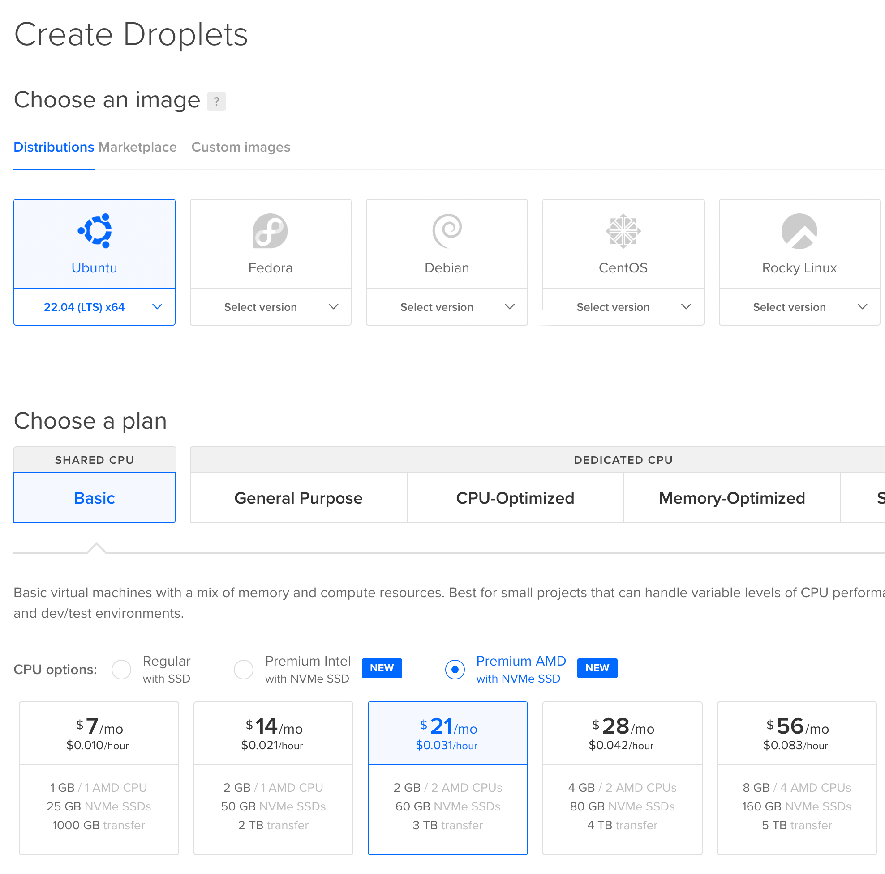
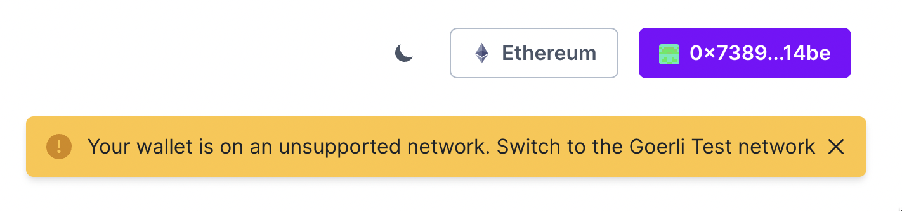
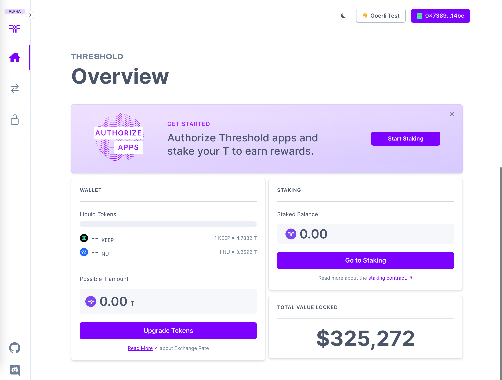
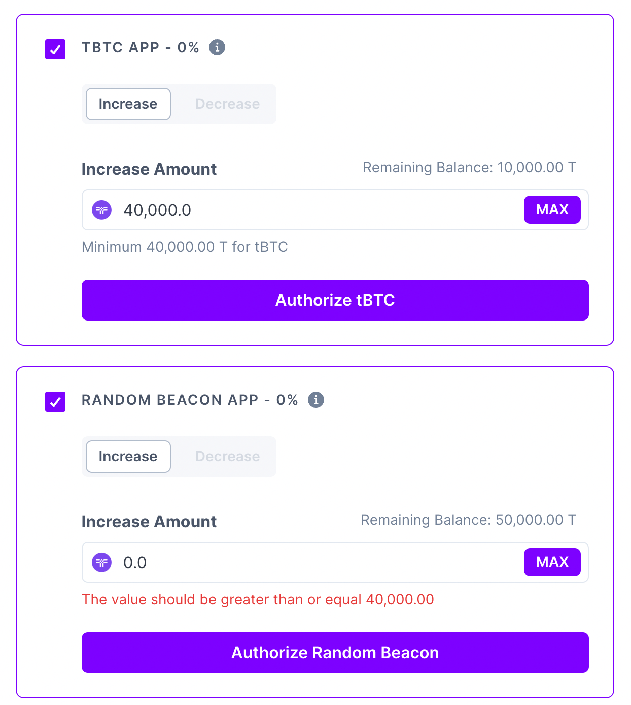
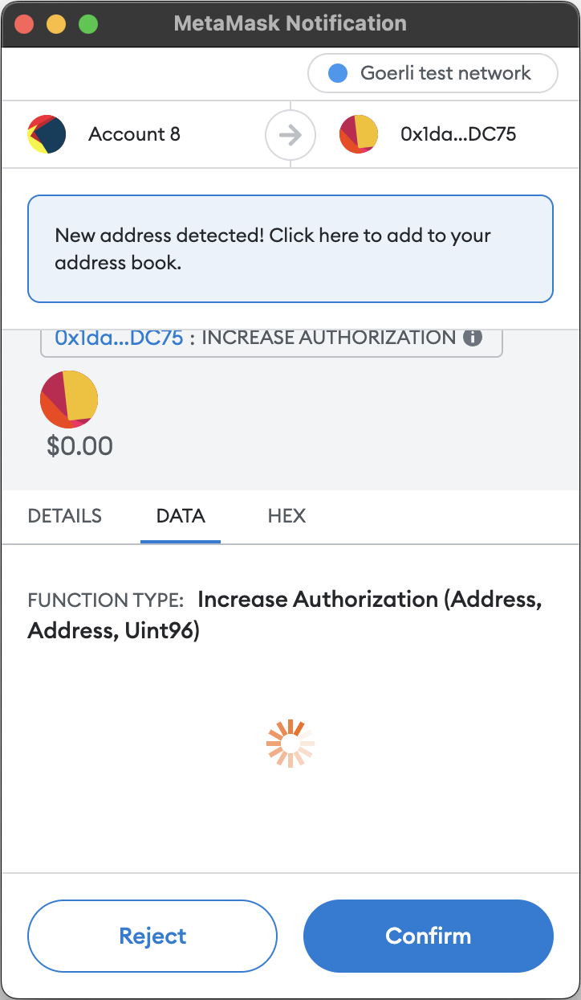
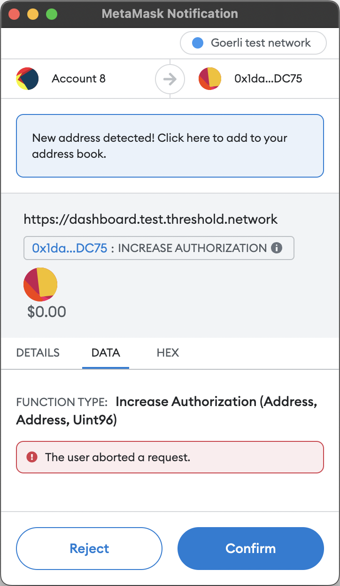
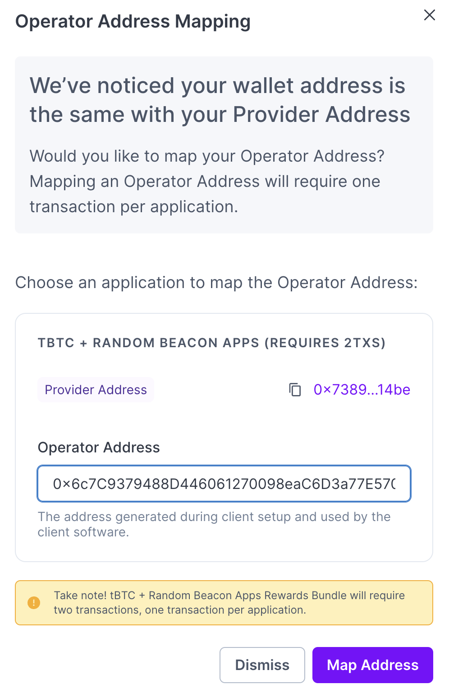
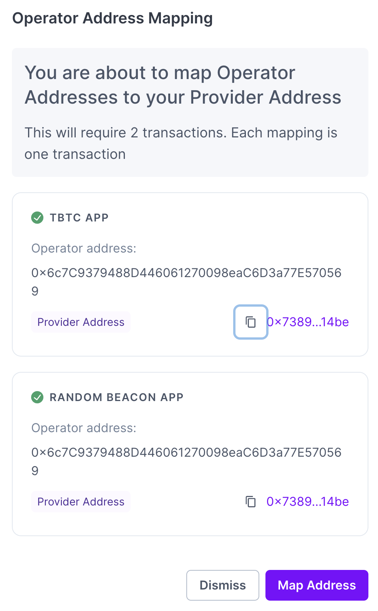
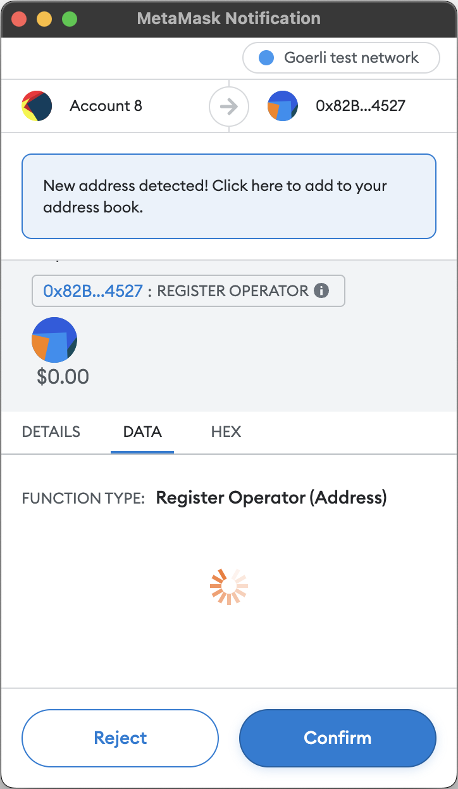
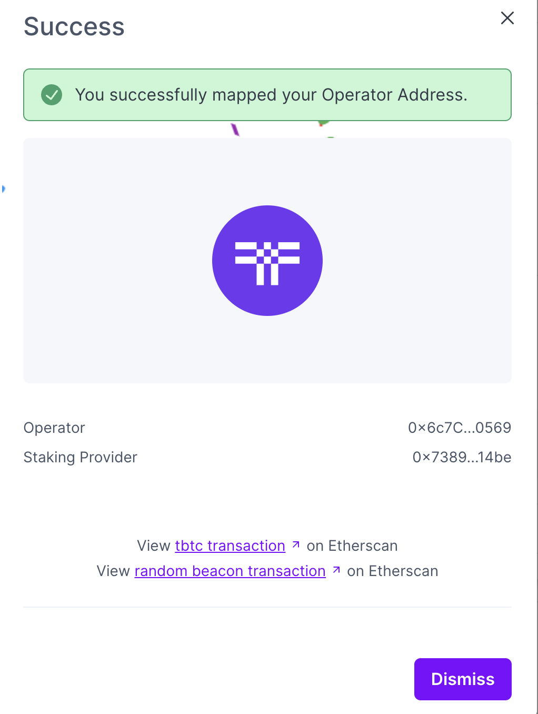

# Diary 

## Day 1

### Part 1

I started with the povided [Gist](https://gist.github.com/sashatanase/9c0543a0db194080b956991fb91ee426).

#### Testnet tBTC v2 node Setup

Started by reading the documentation [Testnet tBTC v2 node Setup](https://docs.threshold.network/app-development/ropsten-testnet-staking/testnet-tbtc-v2-node-setup). I could not find where the doc's respository is located in case I wanted to fork it and make a PR. This would be useful in care anyone from the community wants to contribute to the documentation.

I carefully read the [Ethereum API](https://docs.threshold.network/app-development/ropsten-testnet-staking/testnet-tbtc-v2-node-setup#ethereum-api) section and it is useful because it contains a list of requirements the node setup needs to have.

I chose to use Digital Ocean and started with Ubuntu `22.04 LTS` shared CPU Basic Droplet. 



Digital Ocean Hostname `ubuntu-s-2vcpu-2gb-amd-nyc1-01`.

I started by [installing `geth`](https://geth.ethereum.org/docs/install-and-build/installing-geth#ubuntu-via-ppas).

Set a password for my account:

```sh
$ geth account new --keystore ./operator-key
```

I don't need to configure a firewall and open the specified blocks because this VM is only used for this purpose. I will not be running any other services on it. It doesn't make sense to set up a firewall if I allow all of the open ports anyway.

#### Application Authorization

Going next to [Application Authorization](https://docs.threshold.network/app-development/ropsten-testnet-staking/testnet-tbtc-v2-node-setup#application-authorization)

There is no link to the dashboard in the documentation. I found the link by searching the initially provided [Onboarding Gist](https://gist.github.com/sashatanase/9c0543a0db194080b956991fb91ee426) to point to the testnet.

A list of links to multiple networks can be provided in the doc also ([testnet](https://dashboard.test.threshold.network/overview/network) included). 

I used the public address `[0x73892cf1aa96131732b8a4a071a3e83b167f14be](https://goerli.etherscan.io/address/0x73892cf1aa96131732b8a4a071a3e83b167f14be)` to connect to the dashboard.

If I am not on the the right network, this is the error I get:



Being on the right network, it's unclear what the next step is in the displayed dashboard.

.

The link to "Configure Apps" is not obvious, but I started by staking, already knowing I will need to configure apps at some point. Others might have a harder time figuring out what to do next.

I returned a few hours later after I staked the 50,000 T tokens.

I staked all the tokens I have (50,000 T) but I only selected 40,000 T to pool for the `TBTC` and `RANDOM BEACON APP` apps. I did not stake the remaining 10,000 T because I want to keep them to increase the pool in the future, to see how the experience is like.

I configured each app to use 40,000 T tokens and was guided by the UI to activate each application separately since that was the primary action button.



The fact that I can activate both apps at the same time is not obvious. I had to click on each app checkbox separately to activate them. and then click on the `Authorize selected apps` button.

Unfortunately Metamask doesn't always decode txs successfully. I had to manually decode the txs to see what they were doing.




I sent the first transaction and waited for the tx to be mined in the UI and it asked me to sign a second tx, for the second application. Both txs were mined successfully.

I saw in the docs that the screenshots guide me to use the UI as described above, trying to activate both apps at the same time, even though this still needs 2 txs to finalize.

Because I did not see the "Start mapping" link in the UI, I refreshed the page. Everytime I refresh the page, I need to reconnect my wallet to the dashboard. I think the wallet should remain connected.

Once I refreshed the page a modal apeared asking me to map the address, to which I provided the address generated on the Digital Ocean server (the account generated by `geth`).




I had again to sign and broadcast 2 txs, 1 for each app.



A modal with a confetty animation appeared, congratulating me for mapping the addresses, but the confetti was hidden by a web element, making it almost impossible to see.



EOD

## Day 2

### Part 2

#### Continue setting up the server

I created the 2 folders `storage` and `config` in the newly created home folder `/home/keep`.

```sh
$ mkdir keep
$ cd keep/
$ mkdir storage config
```

And I found the key file I created earlier.

```sh
$ cd ~/operator-key/
$ ls
UTC--2022-10-19T16-44-03.431003526Z--6c7c9379488d446061270098eac6d3a77e570569
```

And copied the keyfile to the new folder.

```sh
$ cp UTC--2022-10-19T16-44-03.431003526Z--6c7c9379488d446061270098eac6d3a77e570569 /home/keep/config/
```

#### Docker

I need docker installed on the server. But first I checked if it is already installed.

```sh
$ docker
Command 'docker' not found, but can be installed with:
snap install docker         # version 20.10.17, or
apt  install docker.io      # version 20.10.12-0ubuntu4
apt  install podman-docker  # version 3.4.4+ds1-1ubuntu1
See 'snap info docker' for additional versions.
```

And I started from the official [Docker documentation](https://docs.docker.com/desktop/install/linux-install/).

First to make sure `kvm` is enabled for my machine.

```sh
$ cat /proc/cpuinfo | grep vendor
vendor_id       : AuthenticAMD
vendor_id       : AuthenticAMD
$ modprobe kvm
$ modprove kvm_amd
$ lsmod | grep kvm
kvm_amd               155648  0
ccp                   102400  1 kvm_amd
kvm                  1028096  1 kvm_amd
```

Next, I need to set kvm device user permissions:

```sh
$ ls -al /dev/kvm
crw-rw---- 1 root kvm 10, 232 Oct 19 16:37 /dev/kvm
```

I am still logged in with my root account and I don't really plan to use a different account for setting up this server. So I don't really need to change the permissions.

I realized I was on the path to install Docker Desktop and I googled how to install Docker Engine and found this link
[https://docs.docker.com/engine/install/ubuntu/](https://docs.docker.com/engine/install/ubuntu/).

First, I need to make sure old versions are uninstalled.

```sh
$ apt remove docker docker-engine docker.io containerd runc
Reading package lists... Done
Building dependency tree... Done
Reading state information... Done
E: Unable to locate package docker-engine
```

I want to set up the repository and install from there.

```sh
$ apt install \
    ca-certificates \
    curl \
    gnupg \
    lsb-release
Reading package lists... Done
Building dependency tree... Done
Reading state information... Done
ca-certificates is already the newest version (20211016).
lsb-release is already the newest version (11.1.0ubuntu4).
lsb-release set to manually installed.
curl is already the newest version (7.81.0-1ubuntu1.4).
gnupg is already the newest version (2.2.27-3ubuntu2.1).
gnupg set to manually installed.
0 upgraded, 0 newly installed, 0 to remove and 2 not upgraded.
```

Adding the gpg key:

```sh
$ mkdir -p /etc/apt/keyrings
$ curl -fsSL https://download.docker.com/linux/ubuntu/gpg | sudo gpg --dearmor -o /etc/apt/keyrings/docker.gpg
```

And adding the repository:

```sh
$ echo \
  "deb [arch=$(dpkg --print-architecture) signed-by=/etc/apt/keyrings/docker.gpg] https://download.docker.com/linux/ubuntu \
  $(lsb_release -cs) stable" | sudo tee /etc/apt/sources.list.d/docker.list > /dev/null
```

Once that is done, I can install docker engine.

```sh
$ apt update
Get:1 http://security.ubuntu.com/ubuntu jammy-security InRelease [110 kB]
Get:2 https://download.docker.com/linux/ubuntu jammy InRelease [48.9 kB]
Hit:3 https://repos.insights.digitalocean.com/apt/do-agent main InRelease
Hit:4 https://repos-droplet.digitalocean.com/apt/droplet-agent main InRelease
Hit:5 http://mirrors.digitalocean.com/ubuntu jammy InRelease
Get:6 https://download.docker.com/linux/ubuntu jammy/stable amd64 Packages [8392 B]
Hit:7 https://ppa.launchpadcontent.net/ethereum/ethereum/ubuntu jammy InRelease
Get:8 http://mirrors.digitalocean.com/ubuntu jammy-updates InRelease [114 kB]
Get:9 http://mirrors.digitalocean.com/ubuntu jammy-backports InRelease [99.8 kB]
Reading package lists... Doneocean.com/ubuntu jammy-updates/main amd64 Packages [662 kB]
Building dependency tree... Donean.com/ubuntu jammy-updates/universe amd64 Packages [435 kB]
Reading state information... Done
2 packages can be upgraded. Run 'apt list --upgradable' to see them.
W: https://repos.insights.digitalocean.com/apt/do-agent/dists/main/InRelease: Key is stored in legacy trusted.gpg keyring (/etc/apt/trusted.gpg), see the DEPRECATION section in apt-key(8) for details.

$ apt install docker-ce docker-ce-cli containerd.io docker-compose-plugin
Reading package lists... Done
Building dependency tree... Done
Reading state information... Done
The following additional packages will be installed:
  docker-ce-rootless-extras docker-scan-plugin libltdl7 libslirp0 pigz
  slirp4netns
Suggested packages:
  aufs-tools cgroupfs-mount | cgroup-lite
The following NEW packages will be installed:
  containerd.io docker-ce docker-ce-cli docker-ce-rootless-extras
  docker-compose-plugin docker-scan-plugin libltdl7 libslirp0 pigz slirp4netns
0 upgraded, 10 newly installed, 0 to remove and 2 not upgraded.
Need to get 112 MB of archives.
After this operation, 443 MB of additional disk space will be used.
Do you want to continue? [Y/n]
Get:1 https://download.docker.com/linux/ubuntu jammy/stable amd64 containerd.io amd64 1.6.8-1 [28.1 MB]
Get:2 http://mirrors.digitalocean.com/ubuntu jammy/universe amd64 pigz amd64 2.6-1 [63.6 kB]
Get:3 http://mirrors.digitalocean.com/ubuntu jammy/main amd64 libltdl7 amd64 2.4.6-15build2 [39.6 kB]
Get:4 http://mirrors.digitalocean.com/ubuntu jammy/main amd64 libslirp0 amd64 4.6.1-1build1 [61.5 kB]
Get:5 http://mirrors.digitalocean.com/ubuntu jammy/universe amd64 slirp4netns amd64 1.0.1-2 [28.2 kB]
Get:6 https://download.docker.com/linux/ubuntu jammy/stable amd64 docker-ce-cli amd64 5:20.10.20~3-0~ubuntu-jammy [41.5 MB]
Get:7 https://download.docker.com/linux/ubuntu jammy/stable amd64 docker-ce amd64 5:20.10.20~3-0~ubuntu-jammy [20.5 MB]
Get:8 https://download.docker.com/linux/ubuntu jammy/stable amd64 docker-ce-rootless-extras amd64 5:20.10.20~3-0~ubuntu-jammy [8389 kB]
Get:9 https://download.docker.com/linux/ubuntu jammy/stable amd64 docker-compose-plugin amd64 2.12.0~ubuntu-jammy [9563 kB]
Get:10 https://download.docker.com/linux/ubuntu jammy/stable amd64 docker-scan-plugin amd64 0.17.0~ubuntu-jammy [3521 kB]
Fetched 112 MB in 5s (22.4 MB/s)
Selecting previously unselected package pigz.
(Reading database ... 94101 files and directories currently installed.)
Preparing to unpack .../0-pigz_2.6-1_amd64.deb ...
Unpacking pigz (2.6-1) ...
Selecting previously unselected package containerd.io.
Preparing to unpack .../1-containerd.io_1.6.8-1_amd64.deb ...
Unpacking containerd.io (1.6.8-1) ...
Selecting previously unselected package docker-ce-cli.
Preparing to unpack .../2-docker-ce-cli_5%3a20.10.20~3-0~ubuntu-jammy_amd64.deb ...
Unpacking docker-ce-cli (5:20.10.20~3-0~ubuntu-jammy) ...
Selecting previously unselected package docker-ce.
Preparing to unpack .../3-docker-ce_5%3a20.10.20~3-0~ubuntu-jammy_amd64.deb ...
Unpacking docker-ce (5:20.10.20~3-0~ubuntu-jammy) ...                                                                                                                             Selecting previously unselected package docker-ce-rootless-extras.
Preparing to unpack .../4-docker-ce-rootless-extras_5%3a20.10.20~3-0~ubuntu-jammy_amd64.deb ...
Unpacking docker-ce-rootless-extras (5:20.10.20~3-0~ubuntu-jammy) ...
Selecting previously unselected package docker-compose-plugin.
Preparing to unpack .../5-docker-compose-plugin_2.12.0~ubuntu-jammy_amd64.deb ...
Unpacking docker-compose-plugin (2.12.0~ubuntu-jammy) ...
Selecting previously unselected package docker-scan-plugin.
Preparing to unpack .../6-docker-scan-plugin_0.17.0~ubuntu-jammy_amd64.deb ...
Unpacking docker-scan-plugin (0.17.0~ubuntu-jammy) ...
Selecting previously unselected package libltdl7:amd64.
Preparing to unpack .../7-libltdl7_2.4.6-15build2_amd64.deb ...
Unpacking libltdl7:amd64 (2.4.6-15build2) ...
Selecting previously unselected package libslirp0:amd64.
Preparing to unpack .../8-libslirp0_4.6.1-1build1_amd64.deb ...
Unpacking libslirp0:amd64 (4.6.1-1build1) ...
Selecting previously unselected package slirp4netns.
Preparing to unpack .../9-slirp4netns_1.0.1-2_amd64.deb ...
Unpacking slirp4netns (1.0.1-2) ...
Setting up docker-scan-plugin (0.17.0~ubuntu-jammy) ...
Setting up containerd.io (1.6.8-1) ...
Created symlink /etc/systemd/system/multi-user.target.wants/containerd.service → /lib/systemd/system/containerd.service.
Setting up docker-compose-plugin (2.12.0~ubuntu-jammy) ...
Setting up libltdl7:amd64 (2.4.6-15build2) ...
Setting up docker-ce-cli (5:20.10.20~3-0~ubuntu-jammy) ...
Setting up libslirp0:amd64 (4.6.1-1build1) ...
Setting up pigz (2.6-1) ...
Setting up docker-ce-rootless-extras (5:20.10.20~3-0~ubuntu-jammy) ...
Setting up slirp4netns (1.0.1-2) ...
Setting up docker-ce (5:20.10.20~3-0~ubuntu-jammy) ...
Created symlink /etc/systemd/system/multi-user.target.wants/docker.service → /lib/systemd/system/docker.service.
Created symlink /etc/systemd/system/sockets.target.wants/docker.socket → /lib/systemd/system/docker.socket.
Processing triggers for man-db (2.10.2-1) ...
Processing triggers for libc-bin (2.35-0ubuntu3.1) ...
Scanning processes...
Scanning linux images...

Running kernel seems to be up-to-date.

No services need to be restarted.

No containers need to be restarted.

No user sessions are running outdated binaries.

No VM guests are running outdated hypervisor (qemu) binaries on this host.
```

I verify that the docker service is installed correctly:

```sh
$ service docker start
$ docker run hello-world
Unable to find image 'hello-world:latest' locally
latest: Pulling from library/hello-world
2db29710123e: Pull complete
Digest: sha256:18a657d0cc1c7d0678a3fbea8b7eb4918bba25968d3e1b0adebfa71caddbc346
Status: Downloaded newer image for hello-world:latest

Hello from Docker!
This message shows that your installation appears to be working correctly.

To generate this message, Docker took the following steps:
 1. The Docker client contacted the Docker daemon.
 2. The Docker daemon pulled the "hello-world" image from the Docker Hub.
    (amd64)
 3. The Docker daemon created a new container from that image which runs the
    executable that produces the output you are currently reading.
 4. The Docker daemon streamed that output to the Docker client, which sent it
    to your terminal.

To try something more ambitious, you can run an Ubuntu container with:
 $ docker run -it ubuntu bash

Share images, automate workflows, and more with a free Docker ID:
 https://hub.docker.com/

For more examples and ideas, visit:
 https://docs.docker.com/get-started/

$ docker --version
Docker version 20.10.20, build 9fdeb9c 
```

#### Launch script

I start working on the launch script.

```sh
$ vim keep.sh
```

And I copy the provided template:

```
# Keep Testnet tBTC v2 Client
#
# Ethereum endpoint WebSocket URL
# This can be a provider such as Infura, Alchemy, Ankr, etc or your own Geth Nodeq
# ETHEREUM_WS_URL="wss://goerli.infura.io/ws/v3/redacted_credentials"
# note: only replace characters inside the " ". The Quotation marks must be retained
ETHEREUM_WS_URL="<Ethereum API WS URL>"

# copied to home/keep/config earlier
OPERATOR_KEY_FILE_NAME="<Operator Account keyfile name>"

# password set during Operator Account Address creation
OPERATOR_KEY_FILE_PASSWORD="<Operator Account keyfile password>"

# To configure your node with a Public IP, enter it below.
PUBLIC_IP="<PUBLIC_IP_OF_MACHINE>"
# Alternatively, you can use DNS.
# To configure DNS, modify the last line of the script
# and add your DNS in the following format:
# /dns4/bootstrap-1.test.keep.network/tcp/3919

# Setup configuration and storage directories
# THESE MUST BE PERSISTENT STORAGE
CONFIG_DIR="/home/keep/config"
STORAGE_DIR="/home/keep/storage"

docker run \
    --detach \
    --restart on-failure \
    --volume $CONFIG_DIR:/mnt/keep/config \
    --volume $STORAGE_DIR:/mnt/keep/storage \
    --env KEEP_ETHEREUM_PASSWORD=$OPERATOR_KEY_FILE_PASSWORD \
    --env LOG_LEVEL=info \
    --log-opt max-size=100m \
    --log-opt max-file=3 \
    -p 3919:3919 \
    -p 9601:9601 \
    us-docker.pkg.dev/keep-test-f3e0/public/keep-client \
    start \
    --goerli \
    --ethereum.url $ETHEREUM_WS_URL \
    --ethereum.keyFile /mnt/keep/config/$OPERATOR_KEY_FILE_NAME \
    --storage.dir /mnt/keep/storage \
    --network.announcedAddresses /ip4/$PUBLIC_IP/tcp/3919

```

I create a new [alchemy app](https://dashboard.alchemy.com/) on Goerli and I add the websockets url to the `ETHEREUM_WS_URL` variable.

Next I need to provide the right value for `OPERATOR_KEY_FILE_NAME` and the associated password `OPERATOR_KEY_FILE_PASSWORD`.

```sh
$ cd operator-key/
$ ls
UTC--2022-10-19T16-44-03.431003526Z--6c7c9379488d446061270098eac6d3a77e570569
```

I obtain the external, fixed IP address of my server and add it in the config file at `PUBLIC_IP`:

```sh
$ ip addr | grep inet
```

Before finishing the start script, I decide I don't want to run it from a user, and I prefer to run it under the `root` user. I move the script to the `/root` directory and I make it executable:

```sh
$ cd /home/keep
$ mv keep.sh /root
```

And also the `config` and `storage` directories:

```sh
$ mv keep/ /root/ -fv
renamed 'keep/' -> '/root/keep'
```

Continue to edit the `keep.sh` script with the updated paths:

```sh
# Setup configuration and storage directories
# THESE MUST BE PERSISTENT STORAGE
CONFIG_DIR="/root/keep/config"
STORAGE_DIR="/root/keep/storage"
```

I check the script once again:

```sh
$ cat keep.sh
# Keep Testnet tBTC v2 Client
#
# Ethereum endpoint WebSocket URL
# This can be a provider such as Infura, Alchemy, Ankr, etc or your own Geth Nodeq
# ETHEREUM_WS_URL="wss://goerli.infura.io/ws/v3/redacted_credentials"
# note: only replace characters inside the " ". The Quotation marks must be retained
ETHEREUM_WS_URL="https://eth-goerli.g.alchemy.com/v2/--REDACTED--"

# copied to home/keep/config earlier
OPERATOR_KEY_FILE_NAME="UTC--2022-10-19T16-44-03.431003526Z--6c7c9379488d446061270098eac6d3a77e570569"

# password set during Operator Account Address creation
OPERATOR_KEY_FILE_PASSWORD="--REDACTED--"

# To configure your node with a Public IP, enter it below.
PUBLIC_IP="--REDACTED--"
# Alternatively, you can use DNS.
# To configure DNS, modify the last line of the script
# and add your DNS in the following format:
# /dns4/bootstrap-1.test.keep.network/tcp/3919

# Setup configuration and storage directories
# THESE MUST BE PERSISTENT STORAGE
CONFIG_DIR="/root/keep/config"
STORAGE_DIR="/root/keep/storage"

docker run \
    --detach \
    --restart on-failure \
    --volume $CONFIG_DIR:/mnt/keep/config \
    --volume $STORAGE_DIR:/mnt/keep/storage \
    --env KEEP_ETHEREUM_PASSWORD=$OPERATOR_KEY_FILE_PASSWORD \
    --env LOG_LEVEL=info \
    --log-opt max-size=100m \
    --log-opt max-file=3 \
    -p 3919:3919 \
    -p 9601:9601 \
    us-docker.pkg.dev/keep-test-f3e0/public/keep-client \
    start \
    --goerli \
    --ethereum.url $ETHEREUM_WS_URL \
    --ethereum.keyFile /mnt/keep/config/$OPERATOR_KEY_FILE_NAME \
    --storage.dir /mnt/keep/storage \
    --network.announcedAddresses /ip4/$PUBLIC_IP/tcp/3919

```

The script looks fine and I make it executable:

```sh
$ chmod +x keep.sh
$ bash ./keep.sh
Unable to find image 'us-docker.pkg.dev/keep-test-f3e0/public/keep-client:latest' locally
213ec9aee27d: Pull complete
17c536332366: Pull complete
Digest: sha256:81b47295efa93dc4acaf74b011630bd775e6ffeb2dcda4d7b6f2eeed380b320e
Status: Downloaded newer image for us-docker.pkg.dev/keep-test-f3e0/public/keep-client:latest
4acd1720c44b2310122a54008cc1bbe42ed02d41681c4dc4dc04062fd5cdcfec
```

I check if the client started successfully.

```sh
$ docker ps
CONTAINER ID   IMAGE                                                 COMMAND                  CREATED         STATUS                          PORTS     NAMES
4acd1720c44b   us-docker.pkg.dev/keep-test-f3e0/public/keep-client   "keep-client start -…"   3 minutes ago   Restarting (1) 47 seconds ago             romantic_varahamihira
```

I dumped the logs to verify and I realized that the client did not start successfully:

```sh
$ docker logs 4ac >& /tmp/keep.log
$ cat /tmp/keep.log

▓▓▌ ▓▓ ▐▓▓ ▓▓▓▓▓▓▓▓▓▓▌▐▓▓▓▓▓▓▓▓▓▓▓▓▓▓▓▓▓▓ ▓▓▓▓▓▓▓▓▓▓▓▓▓▓▓▓▓▓ ▓▓▓▓▓▓▓▓▓▓▓▓▓▓▓▓▓▄
▓▓▓▓▓▓▓▓▓▓ ▓▓▓▓▓▓▓▓▓▓▌▐▓▓▓▓▓▓▓▓▓▓▓▓▓▓▓▓▓▓ ▓▓▓▓▓▓▓▓▓▓▓▓▓▓▓▓▓▓ ▓▓▓▓▓▓▓▓▓▓▓▓▓▓▓▓▓▓▓
  ▓▓▓▓▓▓    ▓▓▓▓▓▓▓▀    ▐▓▓▓▓▓▓    ▐▓▓▓▓▓   ▓▓▓▓▓▓     ▓▓▓▓▓   ▐▓▓▓▓▓▌   ▐▓▓▓▓▓▓
  ▓▓▓▓▓▓▄▄▓▓▓▓▓▓▓▀      ▐▓▓▓▓▓▓▄▄▄▄         ▓▓▓▓▓▓▄▄▄▄         ▐▓▓▓▓▓▌   ▐▓▓▓▓▓▓
  ▓▓▓▓▓▓▓▓▓▓▓▓▓▀        ▐▓▓▓▓▓▓▓▓▓▓         ▓▓▓▓▓▓▓▓▓▓▌        ▐▓▓▓▓▓▓▓▓▓▓▓▓▓▓▓▓
  ▓▓▓▓▓▓▀▀▓▓▓▓▓▓▄       ▐▓▓▓▓▓▓▀▀▀▀         ▓▓▓▓▓▓▀▀▀▀         ▐▓▓▓▓▓▓▓▓▓▓▓▓▓▓▀
  ▓▓▓▓▓▓   ▀▓▓▓▓▓▓▄     ▐▓▓▓▓▓▓     ▓▓▓▓▓   ▓▓▓▓▓▓     ▓▓▓▓▓   ▐▓▓▓▓▓▌
▓▓▓▓▓▓▓▓▓▓ █▓▓▓▓▓▓▓▓▓ ▐▓▓▓▓▓▓▓▓▓▓▓▓▓▓▓▓▓▓ ▓▓▓▓▓▓▓▓▓▓▓▓▓▓▓▓▓▓  ▓▓▓▓▓▓▓▓▓▓
▓▓▓▓▓▓▓▓▓▓ ▓▓▓▓▓▓▓▓▓▓ ▐▓▓▓▓▓▓▓▓▓▓▓▓▓▓▓▓▓▓ ▓▓▓▓▓▓▓▓▓▓▓▓▓▓▓▓▓▓  ▓▓▓▓▓▓▓▓▓▓

Trust math, not hardware.

-------------------------------------------------------------------------------------------------
| Keep Client Node                                                                              |
|                                                                                               |
| Version: v1.3.1-6462-gf3e894fa7 (f3e894fa7)                                                   |
|                                                                                               |
| Operator: 0x6c7C9379488D446061270098eaC6D3a77E570569                                          |
|                                                                                               |
| Port: 3919                                                                                    |
| IPs : /ip4/---REDACTED---/tcp/3919/ipfs/16Uiu2HAkvBkMzNktu7x1aAUSeouawQjqSxFHcD5VBUM9nhtn2WF2 |
|                                                                                               |
| Contracts:                                                                                    |
| RandomBeacon   : 0x0Acf872ea89b73E70Aa1d1b8F46dC01bB71f4B03                                   |
| WalletRegistry : 0x2d51348b1a903aAECF266d0844dA69a178fC1dC7                                   |
| TokenStaking   : 0x1da5d88C26EA4f87b5e09C3452eE2384Ee20DC75                                   |
-------------------------------------------------------------------------------------------------

2022-10-20T09:17:37.730Z        INFO    keep-clientinfo clientinfo/metrics.go:144       observing connected_peers_count with [1m0s] tick
2022-10-20T09:17:37.730Z        INFO    keep-clientinfo clientinfo/metrics.go:144       observing connected_bootstrap_count with [1m0s] tick
2022-10-20T09:17:37.730Z        INFO    keep-clientinfo clientinfo/metrics.go:144       observing eth_connectivity with [10m0s] tick
2022-10-20T09:17:37.730Z        INFO    keep-cmd        cmd/start.go:230        enabled client info endpoint on port [9601]
2022-10-20T09:17:37.853Z        FATAL   keep-cmd        cmd/start.go:36 error initializing beacon: [could not set up sortition pool monitoring: [operator not registered for the staking provider, check Threshold dashboard]]
```

Checking the error I see that the operator was not registered in the dashboard:

```
FATAL   keep-cmd        cmd/start.go:36 error initializing beacon: [could not set up sortition pool monitoring: [operator not registered for the staking provider, check Threshold dashboard]]
```

I searched for "operator" in the documentation and found that the Operator should already be regitered. Checking the mined transactions from my address, I see 2 txs that registered the same operator:

- [0x285d03fda38385e0407ae0c552c717b449b0b131c32fd14930795ca1779fca20](https://goerli.etherscan.io/tx/0x285d03fda38385e0407ae0c552c717b449b0b131c32fd14930795ca1779fca20) 
- [0xce6232a286e05810aca853309e7c41e63b340b068f07d5a4b7677bb5333ba202](https://goerli.etherscan.io/tx/0xce6232a286e05810aca853309e7c41e63b340b068f07d5a4b7677bb5333ba202)

So it seems like the node should run successfully, thus I don't really know why it's not working and I am blocked.